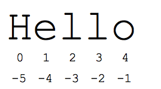

# Strings


From before, we know that Python strings are surrounded by either single or double quotation marks. The Python string data type is essentially a sequence made up of one or more characters that could consists of letters, numbers, whitespace characters, or symbols. Because it is a sequence, we can access characters through **indexing** and **slicing**.





## String Indexing


Each of a string's characters correspond with an index number, starting with the index number 0. Index numbers are essentially positions of each element in the array. From the `Hello` above, we can see that `H` starts at index `0` and the string ends at index `4` with `o`. By referencing the index number of the character inside square brackets `[]`, we can extract individual characters out.


<div markdown="1" class="cell code_cell">
<div class="input_area" markdown="1">
```python
some_string = "Hello"

```
</div>

</div>


<div markdown="1" class="cell code_cell">
<div class="input_area" markdown="1">
```python
some_string[0]

```
</div>

<div class="output_wrapper" markdown="1">
<div class="output_subarea" markdown="1">


{:.output_data_text}
```
'H'
```


</div>
</div>
</div>


<div markdown="1" class="cell code_cell">
<div class="input_area" markdown="1">
```python
some_string[4]

```
</div>

<div class="output_wrapper" markdown="1">
<div class="output_subarea" markdown="1">


{:.output_data_text}
```
'o'
```


</div>
</div>
</div>


Now let's say that we are dealing with a very long string and would like to extract the last character of it. Since Python allows for counting backwards at the end, we can use negative index numbers which start at `-1`.


<div markdown="1" class="cell code_cell">
<div class="input_area" markdown="1">
```python
long_string = "I could not think of a long enough string"

```
</div>

</div>


<div markdown="1" class="cell code_cell">
<div class="input_area" markdown="1">
```python
long_string[-1]

```
</div>

<div class="output_wrapper" markdown="1">
<div class="output_subarea" markdown="1">


{:.output_data_text}
```
'g'
```


</div>
</div>
</div>


Likewise, the second last character can be extracted with the index `-2`.


<div markdown="1" class="cell code_cell">
<div class="input_area" markdown="1">
```python
long_string[-2]

```
</div>

<div class="output_wrapper" markdown="1">
<div class="output_subarea" markdown="1">


{:.output_data_text}
```
'n'
```


</div>
</div>
</div>


## String Slices


We can also extract a range of characters using the `[start:end]` syntax. 

>One of the most important things to note here is that the starting index is **inclusive** and the ending index is **exclusive**.

For instance, `some_string[0:3]` would extract characters in position `0`, `1`, and `2`, but **not** `3`.


<div markdown="1" class="cell code_cell">
<div class="input_area" markdown="1">
```python
some_string = "Hello World"

```
</div>

</div>


<div markdown="1" class="cell code_cell">
<div class="input_area" markdown="1">
```python
some_string[1:4]

```
</div>

<div class="output_wrapper" markdown="1">
<div class="output_subarea" markdown="1">


{:.output_data_text}
```
'ell'
```


</div>
</div>
</div>


If we want to include either end of the string, we can omit one of the indices in the `string[start:end]` syntax. For instance, if I wanted to only print out `Hello`, I could do so by:


<div markdown="1" class="cell code_cell">
<div class="input_area" markdown="1">
```python
some_string[:5]

```
</div>

<div class="output_wrapper" markdown="1">
<div class="output_subarea" markdown="1">


{:.output_data_text}
```
'Hello'
```


</div>
</div>
</div>


Similarly, if I only wanted to print out `World`, I could do so by:


<div markdown="1" class="cell code_cell">
<div class="input_area" markdown="1">
```python
some_string[6:]

```
</div>

<div class="output_wrapper" markdown="1">
<div class="output_subarea" markdown="1">


{:.output_data_text}
```
'World'
```


</div>
</div>
</div>


Though I don't use it much (as I always get confused by it), you can also use negative index numbers to slice a string. For instance, to get `Hello` from `some_string` we can type:


<div markdown="1" class="cell code_cell">
<div class="input_area" markdown="1">
```python
some_string[-11:-6]

```
</div>

<div class="output_wrapper" markdown="1">
<div class="output_subarea" markdown="1">


{:.output_data_text}
```
'Hello'
```


</div>
</div>
</div>


You can also specify the step in which you want to slice the string. Here we can add another argument to our brackets `[]` to do so. Now let's say we want to skip every second character in `some_string`.


<div markdown="1" class="cell code_cell">
<div class="input_area" markdown="1">
```python
some_string[::2]

```
</div>

<div class="output_wrapper" markdown="1">
<div class="output_subarea" markdown="1">


{:.output_data_text}
```
'HloWrd'
```


</div>
</div>
</div>


> Omitting the first two index numbers and retaining the two colons will keep the whole string in range for the `step` argument to slice.


Python also allows for negative steps which is an easy way to reverse a string!


<div markdown="1" class="cell code_cell">
<div class="input_area" markdown="1">
```python
some_string[::-1]

```
</div>

<div class="output_wrapper" markdown="1">
<div class="output_subarea" markdown="1">


{:.output_data_text}
```
'dlroW olleH'
```


</div>
</div>
</div>


> Phew! That was a lot to take in. Don't worry if you didn't remember all of that! The main takeaway here is the syntax `string[start:end:step]`.


## Strings are Immutable


In Python, strings are immutable. This means that a string value cannot be updated. We can verify this by trying to update a character within `some_string`.


<div markdown="1" class="cell code_cell">
<div class="input_area" markdown="1">
```python
some_string[0] = 'm'

```
</div>

<div class="output_wrapper" markdown="1">
<div class="output_subarea" markdown="1">
{:.output_traceback_line}
```

    -----------------------------------------------------------------------

    TypeError                             Traceback (most recent call last)

    <ipython-input-25-f9a0b6f9710f> in <module>()
    ----> 1 some_string[0] = 'm'
    

    TypeError: 'str' object does not support item assignment


```
</div>
</div>
</div>


## Common String Methods


There are many useful string methods when working with strings. The methods below won't cover them all but will at least (hopefully) cover the more important ones from the top of my head.


<div markdown="1" class="cell code_cell">
<div class="input_area" markdown="1">
```python
some_paragraph =  '''
They put me in the oven to bake.
Me, a deprived and miserable cake.
Feeling the heat, I started to bubble.
Watching the others, I knew I was in trouble.

They opened the door and I started my life.
Frosting me with a silver knife,
Decorating me with candy jewels.
The rest of my batch looked like fools.

Lifting me up, she took off my wrapper.
Feeling the breeze, I wanted to slap her.
Opening her mouth with shiny teeth inside,
This was the day this cupcake died.
'''
# Source: https://www.familyfriendpoems.com/poem/the-life-of-a-cupcake

```
</div>

</div>


**1. Finding the length of a string with `len()`**


<div markdown="1" class="cell code_cell">
<div class="input_area" markdown="1">
```python
len(some_paragraph)

```
</div>

<div class="output_wrapper" markdown="1">
<div class="output_subarea" markdown="1">


{:.output_data_text}
```
467
```


</div>
</div>
</div>


**2. Finding the frequency of a sequence with `str.count()`**


<div markdown="1" class="cell code_cell">
<div class="input_area" markdown="1">
```python
some_paragraph.count("I")

```
</div>

<div class="output_wrapper" markdown="1">
<div class="output_subarea" markdown="1">


{:.output_data_text}
```
5
```


</div>
</div>
</div>


<div markdown="1" class="cell code_cell">
<div class="input_area" markdown="1">
```python
some_paragraph.count("ing")

```
</div>

<div class="output_wrapper" markdown="1">
<div class="output_subarea" markdown="1">


{:.output_data_text}
```
7
```


</div>
</div>
</div>


**3. Making the entire string upper or lower case with `str.upper()` and `str.lower()`**


<div markdown="1" class="cell code_cell">
<div class="input_area" markdown="1">
```python
some_string.upper()

```
</div>

<div class="output_wrapper" markdown="1">
<div class="output_subarea" markdown="1">


{:.output_data_text}
```
'HELLO WORLD'
```


</div>
</div>
</div>


<div markdown="1" class="cell code_cell">
<div class="input_area" markdown="1">
```python
some_string.lower()

```
</div>

<div class="output_wrapper" markdown="1">
<div class="output_subarea" markdown="1">


{:.output_data_text}
```
'hello world'
```


</div>
</div>
</div>


**4. Joining and splitting strings with `str.join()` and `str.split()`**  
Let's say we wanted to add a `.` between every letter in a string, we could do so with `str.join()`


<div markdown="1" class="cell code_cell">
<div class="input_area" markdown="1">
```python
".".join(some_string)

```
</div>

<div class="output_wrapper" markdown="1">
<div class="output_subarea" markdown="1">


{:.output_data_text}
```
'H.e.l.l.o. .W.o.r.l.d'
```


</div>
</div>
</div>


Or we wanted to split our `some_string` into a list of words by the space between each word, we could do so with `str.split()`


<div markdown="1" class="cell code_cell">
<div class="input_area" markdown="1">
```python
some_string.split(" ")

```
</div>

<div class="output_wrapper" markdown="1">
<div class="output_subarea" markdown="1">


{:.output_data_text}
```
['Hello', 'World']
```


</div>
</div>
</div>


**5. Replacing strings `str.replace()`**  
How about replacing strings?


<div markdown="1" class="cell code_cell">
<div class="input_area" markdown="1">
```python
some_string.replace("Hello", "Goodbye")

```
</div>

<div class="output_wrapper" markdown="1">
<div class="output_subarea" markdown="1">


{:.output_data_text}
```
'Goodbye World'
```


</div>
</div>
</div>


All these just scratch the surface. You can find more string methods here!

https://www.w3schools.com/python/python_ref_string.asp

