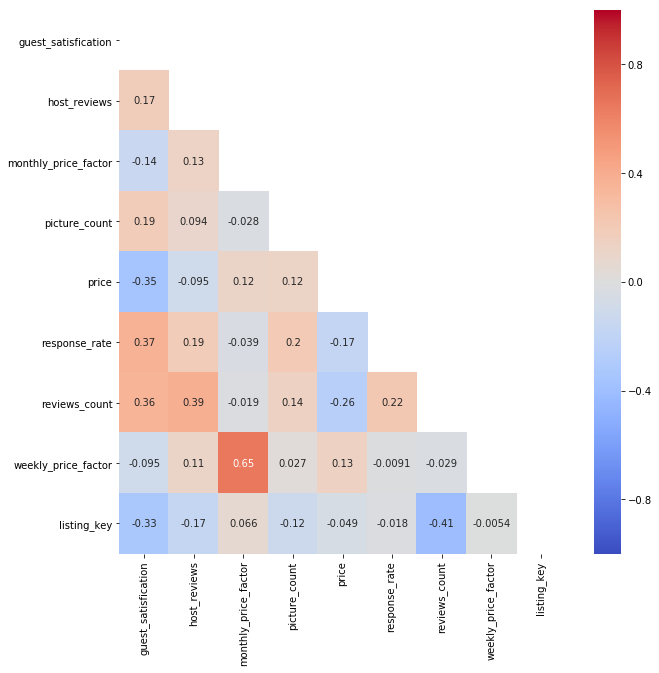

<div markdown="1" class="cell code_cell">
<div class="input_area" markdown="1">
```python
%matplotlib inline
import numpy as np
import pandas as pd
import matplotlib.pyplot as plt
import seaborn as sns
# import pandas_profiling
import statsmodels.formula.api as smf

```
</div>

</div>


<div markdown="1" class="cell code_cell">
<div class="input_area" markdown="1">
```python
cancun_variables = pd.read_csv('../data/processed/cancun_variables.csv')

```
</div>

</div>


<div markdown="1" class="cell code_cell">
<div class="input_area" markdown="1">
```python
features = cancun_variables.drop(columns=['currency', 'url',])

```
</div>

</div>


<div markdown="1" class="cell code_cell">
<div class="input_area" markdown="1">
```python
features.shape

```
</div>

<div class="output_wrapper" markdown="1">
<div class="output_subarea" markdown="1">


{:.output_data_text}
```
(6669, 16)
```


</div>
</div>
</div>


<div markdown="1" class="cell code_cell">
<div class="input_area" markdown="1">
```python
features.head(3)

```
</div>

<div class="output_wrapper" markdown="1">
<div class="output_subarea" markdown="1">


<div markdown="0" class="output output_html">
<div>
<style scoped>
    .dataframe tbody tr th:only-of-type {
        vertical-align: middle;
    }

    .dataframe tbody tr th {
        vertical-align: top;
    }

    .dataframe thead th {
        text-align: right;
    }
</style>
<table border="1" class="dataframe">
  <thead>
    <tr style="text-align: right;">
      <th></th>
      <th>accuracy</th>
      <th>avg_rating</th>
      <th>checkin</th>
      <th>cleanliness</th>
      <th>communication</th>
      <th>guest_satisfication</th>
      <th>host_reviews</th>
      <th>location</th>
      <th>monthly_price_factor</th>
      <th>picture_count</th>
      <th>price</th>
      <th>response_rate</th>
      <th>reviews_count</th>
      <th>value</th>
      <th>weekly_price_factor</th>
      <th>listing_key</th>
    </tr>
  </thead>
  <tbody>
    <tr>
      <th>0</th>
      <td>10</td>
      <td>4.74</td>
      <td>10</td>
      <td>9</td>
      <td>10</td>
      <td>95</td>
      <td>311</td>
      <td>10</td>
      <td>0.88</td>
      <td>19</td>
      <td>22</td>
      <td>100</td>
      <td>50</td>
      <td>10</td>
      <td>0.88</td>
      <td>20776319</td>
    </tr>
    <tr>
      <th>1</th>
      <td>10</td>
      <td>4.93</td>
      <td>10</td>
      <td>10</td>
      <td>10</td>
      <td>99</td>
      <td>147</td>
      <td>10</td>
      <td>0.85</td>
      <td>22</td>
      <td>28</td>
      <td>100</td>
      <td>108</td>
      <td>10</td>
      <td>0.90</td>
      <td>16492050</td>
    </tr>
    <tr>
      <th>2</th>
      <td>10</td>
      <td>4.72</td>
      <td>10</td>
      <td>9</td>
      <td>10</td>
      <td>94</td>
      <td>1376</td>
      <td>9</td>
      <td>1.00</td>
      <td>14</td>
      <td>30</td>
      <td>100</td>
      <td>243</td>
      <td>9</td>
      <td>1.00</td>
      <td>14266451</td>
    </tr>
  </tbody>
</table>
</div>
</div>


</div>
</div>
</div>


<div markdown="1" class="cell code_cell">
<div class="input_area" markdown="1">
```python
features.avg_rating.describe()

```
</div>

<div class="output_wrapper" markdown="1">
<div class="output_subarea" markdown="1">


{:.output_data_text}
```
count    6669.000000
mean        3.148048
std         2.235194
min         0.000000
25%         0.000000
50%         4.600000
75%         4.890000
max         5.000000
Name: avg_rating, dtype: float64
```


</div>
</div>
</div>


<div markdown="1" class="cell code_cell">
<div class="input_area" markdown="1">
```python
features.guest_satisfication.describe()

```
</div>

<div class="output_wrapper" markdown="1">
<div class="output_subarea" markdown="1">


{:.output_data_text}
```
count    6669.000000
mean       62.889639
std        44.739948
min         0.000000
25%         0.000000
50%        92.000000
75%        98.000000
max       100.000000
Name: guest_satisfication, dtype: float64
```


</div>
</div>
</div>


<div markdown="1" class="cell code_cell">
<div class="input_area" markdown="1">
```python
# I ended up choosing guest_satisfication as my main rating metric

```
</div>

</div>


<div markdown="1" class="cell code_cell">
<div class="input_area" markdown="1">
```python
# avg_rating and guest_satisfication have 99.7% correlation. 
# cleanliness, accuracy, communication, location, checkin, and value are all >95% correlated woth
# guest satisfication. I made the decision to remove them as that much correlation would not
# be any additional information added.

# It seems that avg_rating = guest_satisfication / 20 pretty much
features.corr().head()

```
</div>

<div class="output_wrapper" markdown="1">
<div class="output_subarea" markdown="1">


<div markdown="0" class="output output_html">
<div>
<style scoped>
    .dataframe tbody tr th:only-of-type {
        vertical-align: middle;
    }

    .dataframe tbody tr th {
        vertical-align: top;
    }

    .dataframe thead th {
        text-align: right;
    }
</style>
<table border="1" class="dataframe">
  <thead>
    <tr style="text-align: right;">
      <th></th>
      <th>accuracy</th>
      <th>avg_rating</th>
      <th>checkin</th>
      <th>cleanliness</th>
      <th>communication</th>
      <th>guest_satisfication</th>
      <th>host_reviews</th>
      <th>location</th>
      <th>monthly_price_factor</th>
      <th>picture_count</th>
      <th>price</th>
      <th>response_rate</th>
      <th>reviews_count</th>
      <th>value</th>
      <th>weekly_price_factor</th>
      <th>listing_key</th>
    </tr>
  </thead>
  <tbody>
    <tr>
      <th>accuracy</th>
      <td>1.000000</td>
      <td>0.992309</td>
      <td>0.990886</td>
      <td>0.990295</td>
      <td>0.991176</td>
      <td>0.994652</td>
      <td>0.177921</td>
      <td>0.987020</td>
      <td>-0.139480</td>
      <td>0.193348</td>
      <td>-0.359434</td>
      <td>0.369317</td>
      <td>0.362316</td>
      <td>0.992261</td>
      <td>-0.092889</td>
      <td>-0.329599</td>
    </tr>
    <tr>
      <th>avg_rating</th>
      <td>0.992309</td>
      <td>1.000000</td>
      <td>0.989050</td>
      <td>0.990579</td>
      <td>0.989837</td>
      <td>0.997632</td>
      <td>0.172307</td>
      <td>0.985834</td>
      <td>-0.140742</td>
      <td>0.193397</td>
      <td>-0.354868</td>
      <td>0.365996</td>
      <td>0.354550</td>
      <td>0.992373</td>
      <td>-0.093601</td>
      <td>-0.327416</td>
    </tr>
    <tr>
      <th>checkin</th>
      <td>0.990886</td>
      <td>0.989050</td>
      <td>1.000000</td>
      <td>0.988552</td>
      <td>0.993897</td>
      <td>0.991113</td>
      <td>0.179253</td>
      <td>0.988432</td>
      <td>-0.143273</td>
      <td>0.192724</td>
      <td>-0.362077</td>
      <td>0.368950</td>
      <td>0.359717</td>
      <td>0.989198</td>
      <td>-0.095179</td>
      <td>-0.331756</td>
    </tr>
    <tr>
      <th>cleanliness</th>
      <td>0.990295</td>
      <td>0.990579</td>
      <td>0.988552</td>
      <td>1.000000</td>
      <td>0.988507</td>
      <td>0.992760</td>
      <td>0.171952</td>
      <td>0.985116</td>
      <td>-0.138918</td>
      <td>0.193025</td>
      <td>-0.355318</td>
      <td>0.366982</td>
      <td>0.355402</td>
      <td>0.991006</td>
      <td>-0.092434</td>
      <td>-0.328079</td>
    </tr>
    <tr>
      <th>communication</th>
      <td>0.991176</td>
      <td>0.989837</td>
      <td>0.993897</td>
      <td>0.988507</td>
      <td>1.000000</td>
      <td>0.992177</td>
      <td>0.175797</td>
      <td>0.988185</td>
      <td>-0.144677</td>
      <td>0.193033</td>
      <td>-0.361562</td>
      <td>0.369345</td>
      <td>0.359842</td>
      <td>0.990224</td>
      <td>-0.097071</td>
      <td>-0.331289</td>
    </tr>
  </tbody>
</table>
</div>
</div>


</div>
</div>
</div>


<div markdown="1" class="cell code_cell">
<div class="input_area" markdown="1">
```python
filtered_features = features.drop(columns=['accuracy', 'checkin', 'cleanliness', 'communication',
                                           'location', 'value', 'avg_rating'])

```
</div>

</div>


<div markdown="1" class="cell code_cell">
<div class="input_area" markdown="1">
```python
filtered_features_corr = filtered_features.corr()

# Filter out correlations <0.20 to make graph easier to read
# filtered_features_corr[np.abs(filtered_features_corr)<.2] = 0

# Create mask to only include half of matrix
mask = np.zeros_like(filtered_features_corr, dtype=np.bool)
mask[np.triu_indices_from(mask)] = True

plt.figure(figsize=(10,10))
sns.heatmap(filtered_features_corr,
            vmin=-1,
            vmax=1,
            cmap='coolwarm',
            annot=True,
            mask=mask);

```
</div>

<div class="output_wrapper" markdown="1">
<div class="output_subarea" markdown="1">

{:.output_png}


</div>
</div>
</div>


<div markdown="1" class="cell code_cell">
<div class="input_area" markdown="1">
```python
# This looks much better now
# There still seems to be high correlation between weekly_price_factor and monthly_price_factor
# but we can start working on feature importance right now.

```
</div>

</div>


<div markdown="1" class="cell code_cell">
<div class="input_area" markdown="1">
```python
filtered_features.shape

```
</div>

<div class="output_wrapper" markdown="1">
<div class="output_subarea" markdown="1">


{:.output_data_text}
```
(6669, 9)
```


</div>
</div>
</div>


<div markdown="1" class="cell code_cell">
<div class="input_area" markdown="1">
```python
# Response is guest satisfication and let's see if we can rank feature importance.

```
</div>

</div>


<div markdown="1" class="cell code_cell">
<div class="input_area" markdown="1">
```python
filtered_features.columns

```
</div>

<div class="output_wrapper" markdown="1">
<div class="output_subarea" markdown="1">


{:.output_data_text}
```
Index(['guest_satisfication', 'host_reviews', 'monthly_price_factor',
       'picture_count', 'price', 'response_rate', 'reviews_count',
       'weekly_price_factor', 'listing_key'],
      dtype='object')
```


</div>
</div>
</div>


<div markdown="1" class="cell code_cell">
<div class="input_area" markdown="1">
```python
# Quick linear regression

model = smf.ols(formula="guest_satisfication ~ host_reviews +  \
                         response_rate + reviews_count"
                         , data=filtered_features).fit()
model.summary()

```
</div>

<div class="output_wrapper" markdown="1">
<div class="output_subarea" markdown="1">


<div markdown="0" class="output output_html">
<table class="simpletable">
<caption>OLS Regression Results</caption>
<tr>
  <th>Dep. Variable:</th>    <td>guest_satisfication</td> <th>  R-squared:         </th> <td>   0.214</td> 
</tr>
<tr>
  <th>Model:</th>                    <td>OLS</td>         <th>  Adj. R-squared:    </th> <td>   0.214</td> 
</tr>
<tr>
  <th>Method:</th>              <td>Least Squares</td>    <th>  F-statistic:       </th> <td>   605.4</td> 
</tr>
<tr>
  <th>Date:</th>              <td>Wed, 07 Aug 2019</td>   <th>  Prob (F-statistic):</th>  <td>  0.00</td>  
</tr>
<tr>
  <th>Time:</th>                  <td>12:33:25</td>       <th>  Log-Likelihood:    </th> <td> -34007.</td> 
</tr>
<tr>
  <th>No. Observations:</th>       <td>  6669</td>        <th>  AIC:               </th> <td>6.802e+04</td>
</tr>
<tr>
  <th>Df Residuals:</th>           <td>  6665</td>        <th>  BIC:               </th> <td>6.805e+04</td>
</tr>
<tr>
  <th>Df Model:</th>               <td>     3</td>        <th>                     </th>     <td> </td>    
</tr>
<tr>
  <th>Covariance Type:</th>       <td>nonrobust</td>      <th>                     </th>     <td> </td>    
</tr>
</table>
<table class="simpletable">
<tr>
        <td></td>           <th>coef</th>     <th>std err</th>      <th>t</th>      <th>P>|t|</th>  <th>[0.025</th>    <th>0.975]</th>  
</tr>
<tr>
  <th>Intercept</th>     <td>   29.9913</td> <td>    1.062</td> <td>   28.230</td> <td> 0.000</td> <td>   27.909</td> <td>   32.074</td>
</tr>
<tr>
  <th>host_reviews</th>  <td>    0.0003</td> <td>    0.001</td> <td>    0.260</td> <td> 0.795</td> <td>   -0.002</td> <td>    0.003</td>
</tr>
<tr>
  <th>response_rate</th> <td>    0.3432</td> <td>    0.013</td> <td>   27.096</td> <td> 0.000</td> <td>    0.318</td> <td>    0.368</td>
</tr>
<tr>
  <th>reviews_count</th> <td>    0.3186</td> <td>    0.013</td> <td>   24.009</td> <td> 0.000</td> <td>    0.293</td> <td>    0.345</td>
</tr>
</table>
<table class="simpletable">
<tr>
  <th>Omnibus:</th>       <td>1623.017</td> <th>  Durbin-Watson:     </th> <td>   1.716</td> 
</tr>
<tr>
  <th>Prob(Omnibus):</th>  <td> 0.000</td>  <th>  Jarque-Bera (JB):  </th> <td> 497.919</td> 
</tr>
<tr>
  <th>Skew:</th>           <td>-0.452</td>  <th>  Prob(JB):          </th> <td>7.56e-109</td>
</tr>
<tr>
  <th>Kurtosis:</th>       <td> 2.013</td>  <th>  Cond. No.          </th> <td>1.10e+03</td> 
</tr>
</table><br/><br/>Warnings:<br/>[1] Standard Errors assume that the covariance matrix of the errors is correctly specified.<br/>[2] The condition number is large, 1.1e+03. This might indicate that there are<br/>strong multicollinearity or other numerical problems.
</div>


</div>
</div>
</div>


<div markdown="1" class="cell code_cell">
<div class="input_area" markdown="1">
```python
# I don't think price should be a variable. It's mre of a filter to me

```
</div>

</div>


<div markdown="1" class="cell code_cell">
<div class="input_area" markdown="1">
```python
# TODO: scikit-learn for feature importance ranking.

```
</div>

</div>


<div markdown="1" class="cell code_cell">
<div class="input_area" markdown="1">
```python
# To possibly think of: scraping reviews to score on sentiment/positive value

```
</div>

</div>


<div markdown="1" class="cell code_cell">
<div class="input_area" markdown="1">
```python
filtered_features.to_csv('filtered_features.csv', index=False)

```
</div>

</div>

